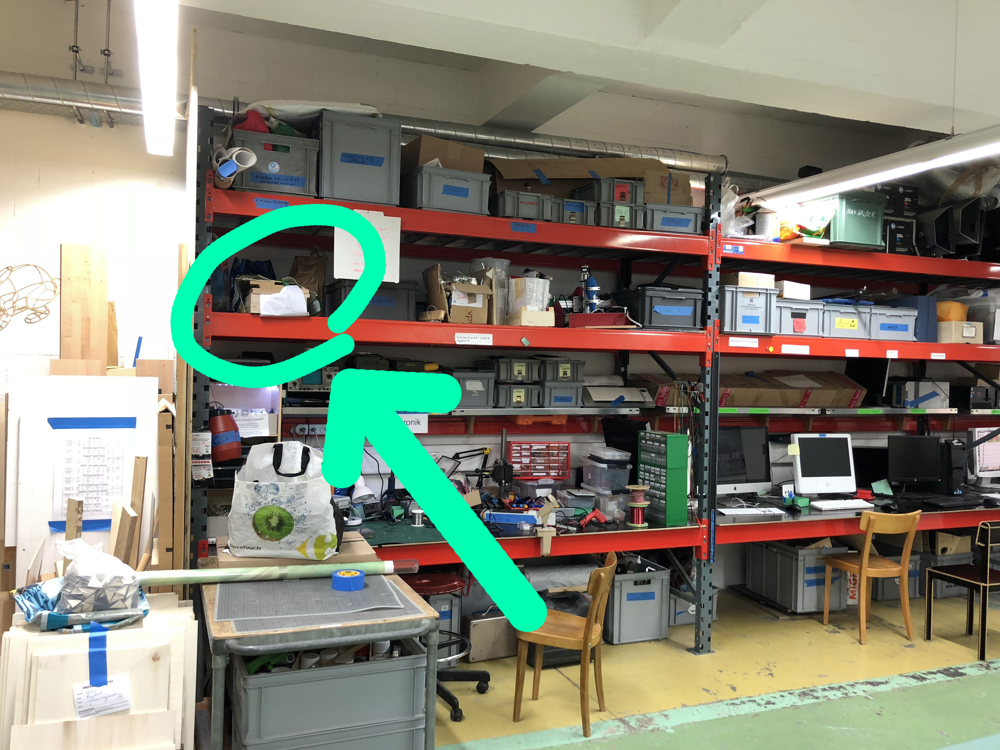
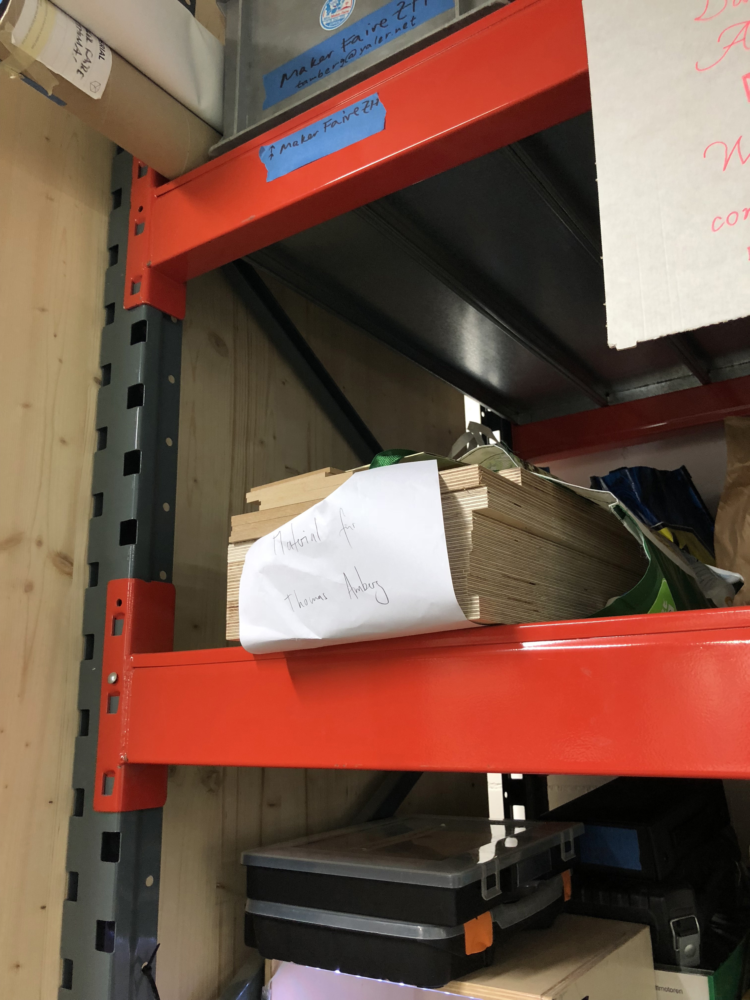
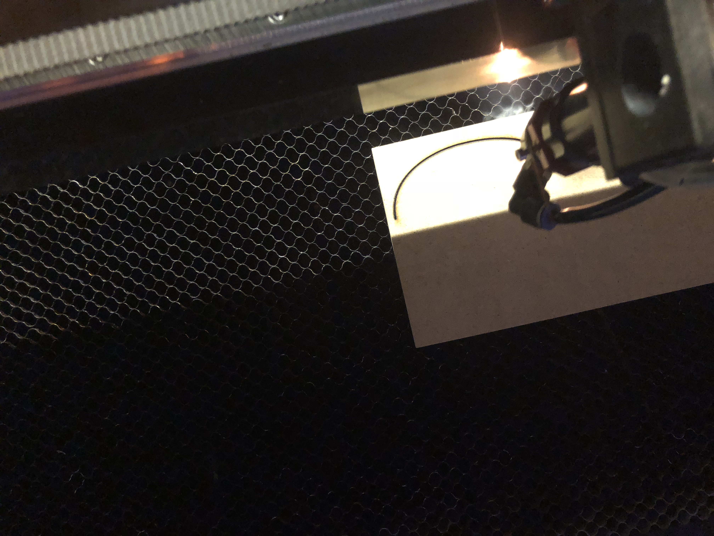
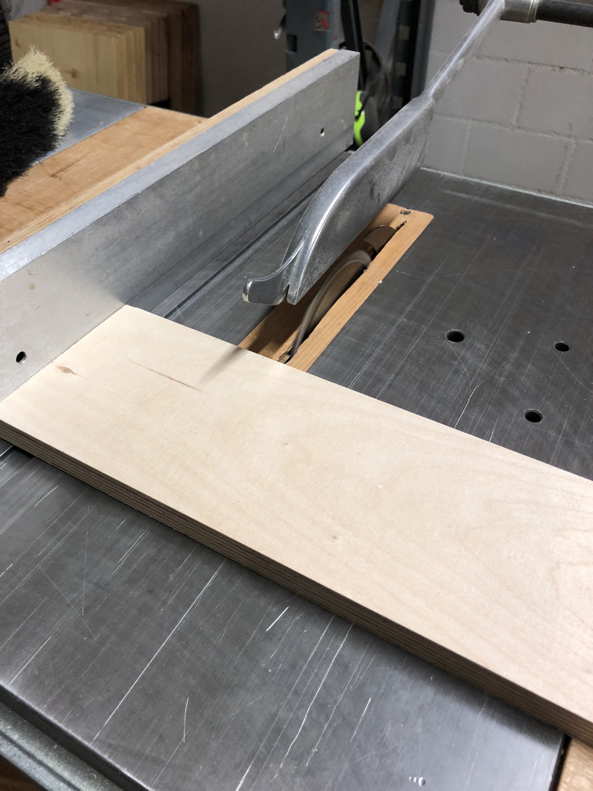
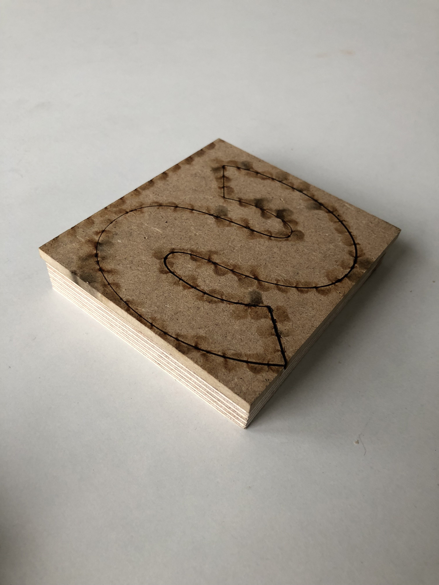
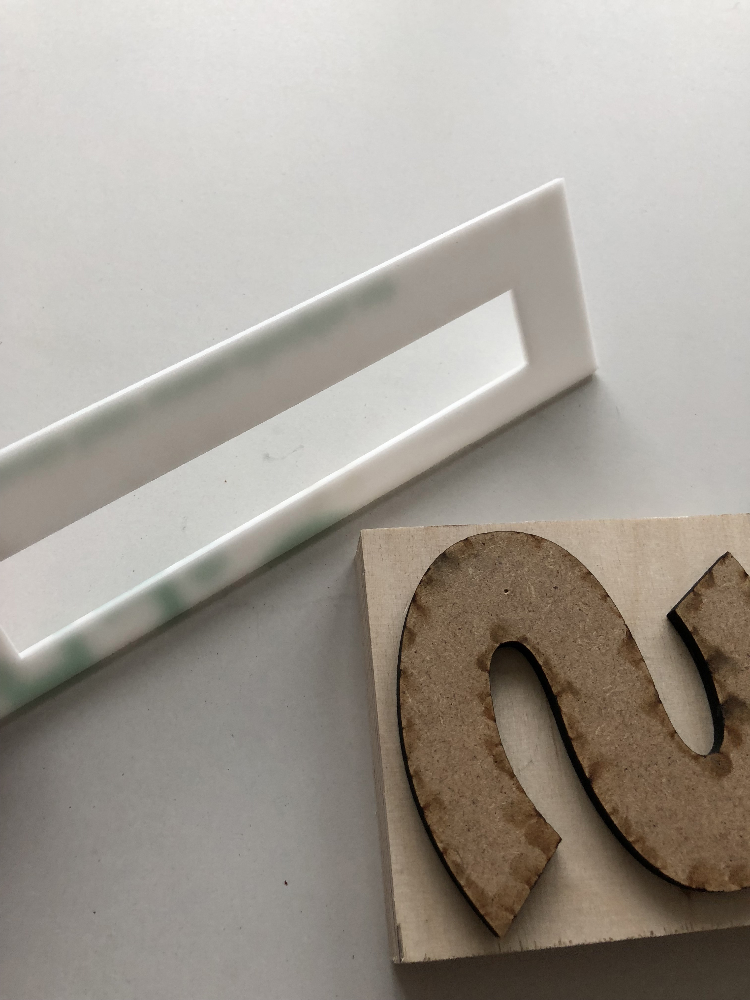
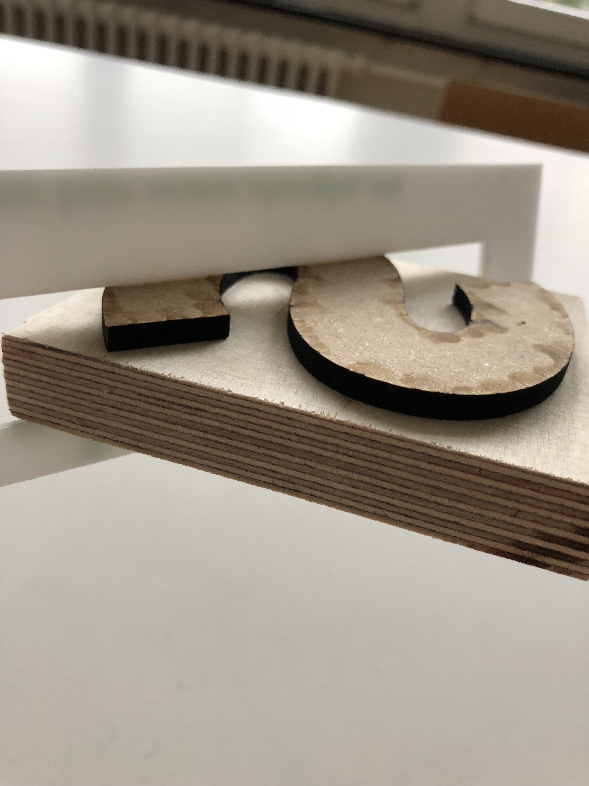

# Info · Fablab

# ACHTUNG!!!
## Wir produzieren wie ein Stempel. Damit nach dem Drucken alles richtig ist, muss der «Stempel» spiegelverkehrt sein!!! Also spiegelverkehrt aufkleben, seitenrichtig lasern.

## Pro Person
* 1 Buchstaben gross
* 3 Buchstaben klein

## Material

### Buchstaben klein (~24 Cicero)
* 7 × 18 mm × 550 mm × 108 mm – Sperrholz Birke
* 7 × 5 mm × 550 mm × 108 mm – MDF
* 1 × 18 mm × 450 mm × 108 mm – Sperrholz Birke
* 1 × 5 mm × 450 mm × 108 mm – MDF

### Buchstaben gross (~32 Cicero)
* 5 × 18 mm × 550 mm × 144 mm – Sperrholz Birke
* 5 × 5 mm × 550 mm × 144 mm – MDF

### Sonstiges
* 2 × Holzleim
* 2 × Lehre um Schrifthöhe zu prüfen (siehe unten)
* 2 × Schleifpapier

## Anleitung

### Datei (mit Stefan Huber)
* Dateien als .ai-Files auf das richtige Format vorbereiten. AI3 abspeichern.
* Die einzelnen Buchstaben sind durch eine Linie abgetrennt

### Datei für Laser vorbereiten
Instruktion siehe [Wiki](http://wiki.zurich.fablab.ch/AKJ_6090) und Thomas.

### Material rechtwinklig (!) platzieren
Ob etwas im rechten Winel steht, kann auch mit dem Laser (Nullpunkt) geprüft werden.

### brzzzz...
AKJ 6090 (der Neue) – 6 mm/s – 75 % Energie  
Ist aber eher zuviel.

### Länge auf Träger anzeichnen

### Träger ablängen

### Aufleimen mit Hilfe vom «Abfall»

### «Abfall» vor Trocknung abziehen

### Fertiger Buchstabe muss durch Lehre passen

